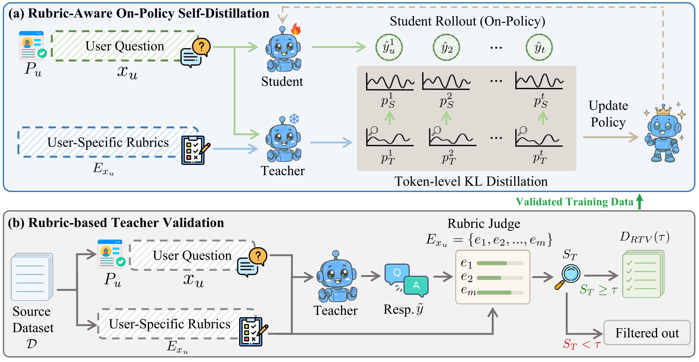

<div align="center">

<h1>Rubric-Aware On-Policy Self-Distillation for LLM Personalization</h1>

This is the implementation of the **GRASP** framework proposed in our paper.



</div>

<a id="catalogue"></a>

## 📋 Catalogue

- [📂 Layout](#layout)
- [⚙️ Environment Setup](#environment-setup)
- [📚 Dataset Preprocess](#dataset-preprocess)
- [⌛️ Quick Start](#quick-start)

<a id="layout"></a>

## 📂 Layout

```text
src/             GRASP implementation
scripts/data/    data preparation
scripts/train/   training
scripts/rtv/     teacher validation and filtering
scripts/eval/    evaluation
train_engine/    modified ms-swift engine
eval_src/        LaMP-QA evaluator
fig/             framework figure
```

<a id="environment-setup"></a>

## ⚙️ Environment Setup

```bash
conda create -n grasp python=3.11
conda activate grasp
pip install -r requirements.txt
```

<a id="dataset-preprocess"></a>

## 📚 Dataset Preprocess

Place the LaMP-QA splits in `data/raw/{train,validation,test}.jsonl`, then build
training data using a local model path:

```bash
STUDENT=/path/to/Qwen2.5-7B-Instruct bash scripts/data/build_all.sh
```

Output: `data/processed/train_pi_aspects.jsonl`.

<a id="quick-start"></a>

## ⌛️ Quick Start

### Train

```bash
MODEL=/path/to/Qwen2.5-7B-Instruct OUT=outputs/grasp \
  bash scripts/train/train.sh qwen
```

Override paths and hyperparameters through environment variables in `scripts/train/train.sh`.
For Gemma, prepare data with `src/build_data.py --family gemma` and use `train.sh gemma`.

### RTV

With teacher and judge endpoints running:

```bash
GEN_URL=http://127.0.0.1:8400/v1 JUDGE_URL=http://127.0.0.1:8500/v1 \
  TAU=1.0 bash scripts/rtv/run_rtv.sh
MODEL=/path/to/Qwen2.5-7B-Instruct DATA=data/processed/train_pi_aspects_rtv100.jsonl \
  bash scripts/rtv/train_rtv_filtered.sh
```

### Evaluate

```bash
ARM=grasp FAMILY=qwen25 RUN=outputs/grasp/vX-YYYY \
  SPLIT=val bash scripts/eval/run_val_auto.sh
```

Set `RUN` to your run directory. This evaluates all its checkpoints on validation;
use the individual serving, generation, and judging scripts to test the selected checkpoint.
